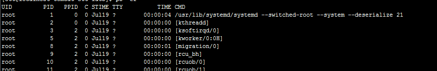
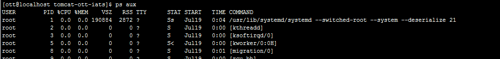

# Linux 命令
## PS

- ps -ef 

<table>
	<tr>
	     <td>UID</td>
	     <td>PID</td>
	     <td>PPID</td>
	     <td>C</td>
	     <td>STIME</td>
	     <td>TIY</td>
	     <td>TIME</td>
	     <td>CMD</td>
  </tr>
  <tr>
	  <td>用户id</td>
	  <td>进程id</td>
	  <td>父进程id</td>
	  <td>CPU占用</td>
	  <td>开始时间</td>
	  <td>开始此进程的TTY----终端设备</td>
	  <td> 此进程运行的总时间</td>
	  <td>启动命令</td>	  
  </tr>
</table>
- ps -aux

<table>
	<tr>
	     <td>UID</td>
	     <td>PID</td>
	     <td>%CPU</td>
	     <td>%MEM</td>
	     <td>VSZ</td>
	     <td>RSS</td>
	     <td>TIY</td>
	     <td>STAT</td>
	     <td>START</td>
	     <td>TIME</td>
	     <td>CMD</td>
  </tr>
  <tr>
	  <td>用户id</td>
	  <td>进程id</td>
	  <td>CPU占用</td>
	  <td>内存占用</td>
	  <td>进程使用的虚拟內存量（KB）</td>
	  <td>進程占用的固定內存量（KB）</td>
	 <td>开始此进程的TTY----终端设备</td>
	  <td>状态</td>
	  <td>开始时间</td>
	  <td> 此进程运行的总时间</td>
	  <td>启动命令</td>	  
  </tr>
</table>
> Stat: 状态
> - D 无法中断的休眠状态（通常 IO 的进程）
> - R 正在运行可中在队列中可过行的；
> - S 处于休眠状态；
> - T 停止或被追踪；
> - W 进入内存交换  （从内核2.6开始无效）；
> - X 死掉的进程   （基本很少見）；
> - Z 僵尸进程；
> - < 优先级高的进程
> - N 优先级较低的进程
> - L 有些页被锁进内存；
> - s 进程的领导者（在它之下有子进程）；
> - l 多进程的（使用 CLONE_THREAD, 类似 NPTL pthreads）；
> - \+ 位于后台的进程组；

### localhost无法解析
    1. 使用hostname localhost来指定临时
    2. 修改/etc/systemconfig/network,添加NETWORKING=yes HOSTNAME=localhost来长期生效